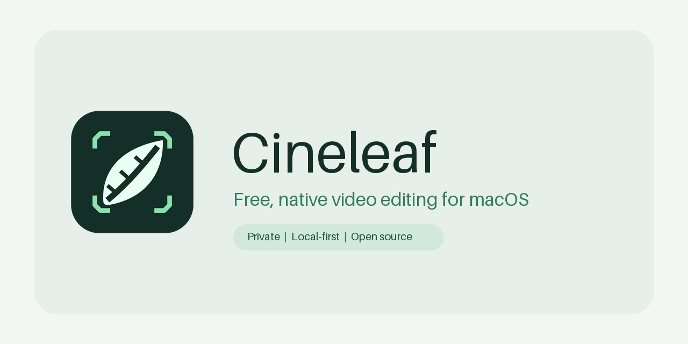

<p align="center">
  
</p>

<p align="center">
  <strong>Free, private, native video editing for macOS.</strong><br>
  No account. No cloud. No ads. No watermark.
</p>

<p align="center">
  <a href="https://github.com/luucabg/cineleaf/actions/workflows/ci.yml"></a>
  <a href="LICENSE"></a>
  
</p>



## What is Cineleaf?

Cineleaf is a video editor made especially for Mac. The goal is simple: let anyone put clips in order, trim them, add text and audio, preview the result, and export a clean video without creating an account or learning a complicated professional suite.

Everything happens on your Mac. Cineleaf does not upload your videos, collect analytics, show advertisements, add a watermark, or ask for a subscription.

> **Development status:** Cineleaf is pre-release software. Its macOS build and 30 automated tests pass, including a real synthetic video export and English/Spanish interface flows. There is no public download yet because a person still needs to complete the full edit-and-export review on a real Mac. See [STATUS.md](STATUS.md) for the evidence-based status.

## Super optimized for a fluid editing feel

Cineleaf is engineered as a super-optimized native macOS app rather than a website wrapped in a desktop window. That means it can use Apple's media hardware directly and avoid layers of web technology.

Its performance design includes:

- Media decoding and encoding through AVFoundation and the Mac's hardware support.
- Importing, thumbnails, audio waveforms, saving, preview building, and exporting away from the main interface thread.
- A custom AppKit timeline that draws only the visible area plus a small margin.
- Small, bounded memory and disk caches that can be cleared safely in Settings.
- Downsampled audio waveforms instead of millions of raw samples on screen.
- Exact frame-sensitive time rather than drifting decimal seconds.
- Cancellation of obsolete preview, thumbnail, waveform, and export work.
- No complete source video loaded into memory.

These are implemented engineering choices, not a made-up benchmark claim. Measured results will be published in [Documentation/PERFORMANCE.md](Documentation/PERFORMANCE.md) after testing on real Macs.

## What is being built for 0.1.0?

The first release is deliberately focused on the everyday path:

- Create landscape, vertical, square, or portrait projects at common frame rates.
- Import local video, audio, and image files.
- Arrange multiple video and audio tracks; move, trim, split, duplicate, mute, lock, and snap clips.
- Preview the composed timeline, including gaps, transforms, opacity, fades, text, and audio mixing.
- Add styled text using fonts already installed on the Mac.
- Adjust position, scale, rotation, crop, opacity, audio level, and fades.
- Save and reopen `.cineleaf` project packages, with autosave and recovery.
- Export H.264 or HEVC video as MP4 or MOV at 720p, 1080p, 1440p, or 4K.
- Use the interface in English or Spanish.

These items describe the `0.1.0` acceptance target. They are not advertised as a released feature set until the gates in [PLAN.md](PLAN.md) pass.

## Current screenshots

Real application screenshots are intentionally not shown yet because this repository was bootstrapped on a Windows host that cannot launch a macOS app. Cineleaf will never use fabricated screenshots. English, Spanish, timeline, text-inspector, and export screenshots will be added after the interface runs and is reviewed on macOS.

## Privacy in plain language

- Your source media stays where you put it.
- Cineleaf has no account, server, cloud feature, analytics, telemetry, advertising, or tracking code.
- Project files contain edit decisions and local references to your media.
- Clearing the cache never removes a project or its source videos.

Read the complete [privacy statement](PRIVACY.md).

## Mac requirements

- macOS 14 Sonoma or later.
- Apple Silicon or Intel Mac. Universal builds are planned; Intel remains unverified until suitable CI or hardware is available.
- Xcode 16.4 (Apple Swift 6.1.2), using Swift 5 language mode for the app and Swift tools 5.10 for `CineleafCore`.
- XcodeGen 2.42 or later to regenerate `Cineleaf.xcodeproj` from `project.yml`.

The exact first bootstrap environment was Windows 10 Pro with Git 2.54.0 and GitHub CLI 2.94.0; it had no Swift or Xcode. The verified macOS CI toolchain is Xcode 16.4 build 16F6 with Apple Swift 6.1.2.

## Build it yourself

This section is for developers. Regular users should wait for the first tested release.

```bash
brew install xcodegen
git clone https://github.com/luucabg/cineleaf.git
cd cineleaf
xcodegen generate
xcodebuild -project Cineleaf.xcodeproj -scheme Cineleaf -destination 'platform=macOS' build CODE_SIGNING_ALLOWED=NO
```

Open `Cineleaf.xcodeproj` in Xcode if you prefer the graphical interface.

Run all tests:

```bash
swift test --package-path Packages/CineleafCore
xcodebuild -project Cineleaf.xcodeproj -scheme Cineleaf -destination 'platform=macOS' test CODE_SIGNING_ALLOWED=NO
```

Create an unsigned universal release build, ZIP, DMG, and checksums:

```bash
./scripts/build_release.sh
```

Output appears in `dist/`. The script uses ad-hoc signing and never claims notarization.

## Installing an unsigned build

Cineleaf does not require a paid Apple Developer account, but macOS may warn about an unsigned or non-notarized app.

1. Drag `Cineleaf.app` into Applications.
2. In Finder, Control-click or right-click Cineleaf and choose **Open**.
3. Choose **Open** again in the warning.
4. If macOS still blocks it, open **System Settings → Privacy & Security** and choose **Open Anyway** for Cineleaf.

Do not disable Gatekeeper or other Mac security features.

## Languages and translations

English is the base language and Spanish for Spain is included. In the app, choose **Settings → General → Language** and select the system default, English, or Español.

To improve a translation, edit `Cineleaf/Resources/Localizable.xcstrings` in Xcode's String Catalog editor. Every key must keep English and Spanish entries, matching format arguments, and valid plural forms. Run the localization tests before opening a pull request.

## Roadmap, help, and contributing

- [Roadmap](ROADMAP.md)
- [Current status](STATUS.md)
- [Contributing guide](CONTRIBUTING.md)
- [Architecture](Documentation/ARCHITECTURE.md)
- [Project format](Documentation/PROJECT_FORMAT.md)
- [Rendering pipeline](Documentation/RENDERING_PIPELINE.md)
- [Security policy](SECURITY.md)
- [Code of conduct](CODE_OF_CONDUCT.md)

Bug reports and focused contributions are welcome. You do not need to be a professional video engineer to improve wording, translations, accessibility, documentation, or reproducible test cases.

## License

Cineleaf is available under the [MIT License](LICENSE). It currently has no third-party runtime dependency outside Apple's system frameworks. Build-time tooling and licenses are listed in [THIRD_PARTY_NOTICES.md](THIRD_PARTY_NOTICES.md).
